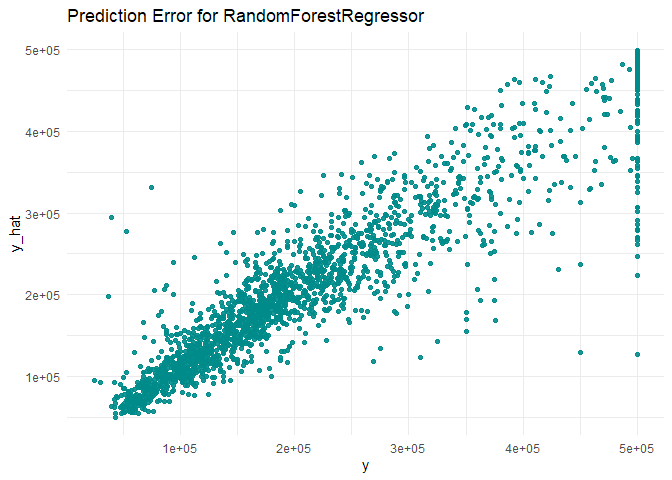
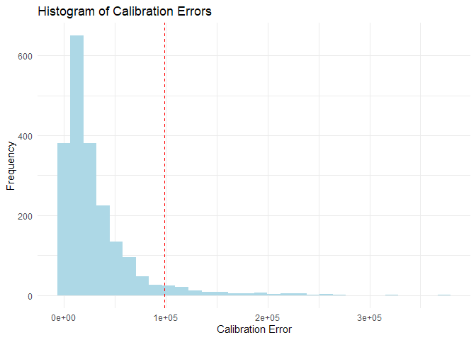
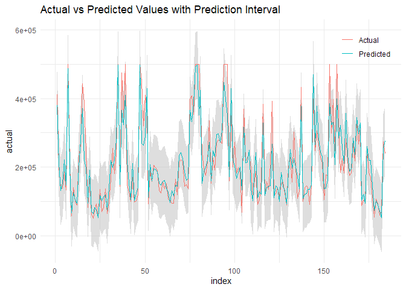
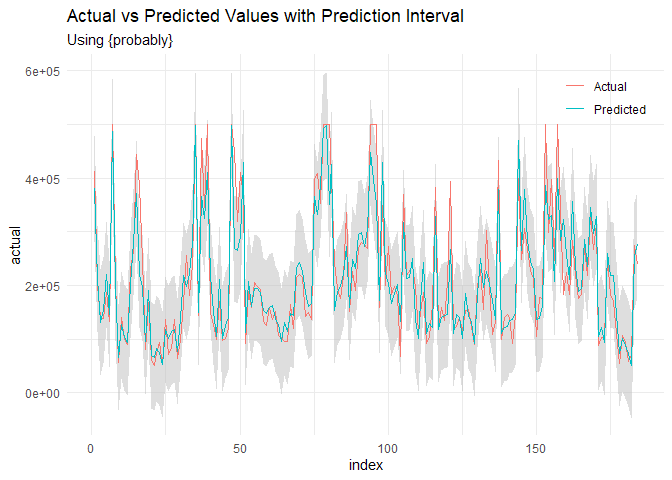
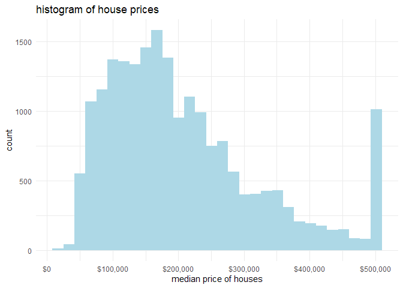
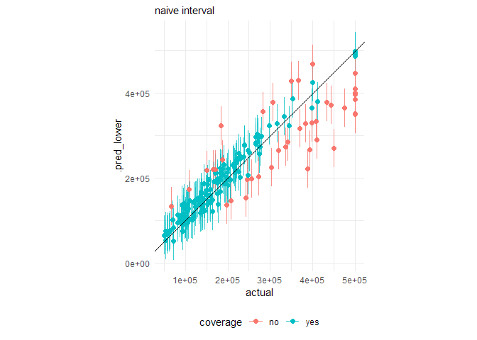
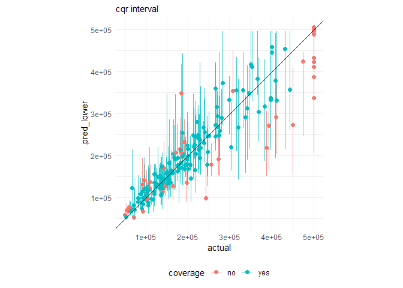
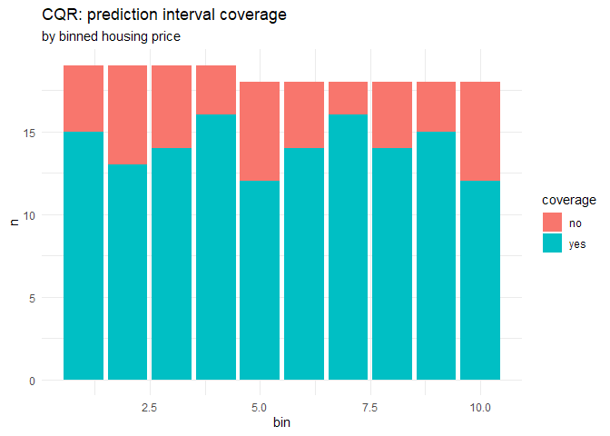
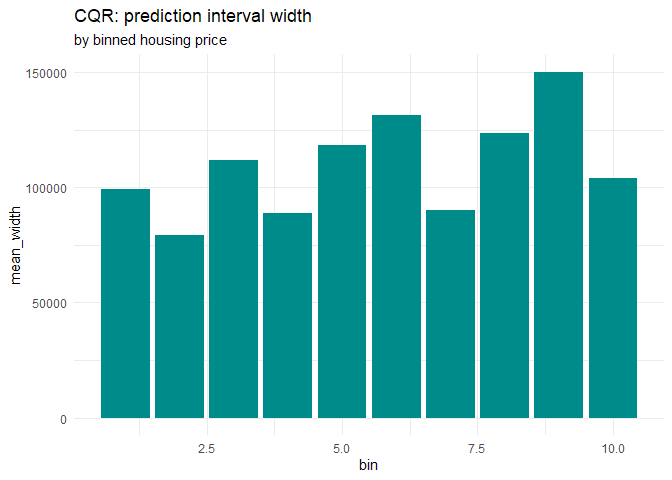

# Chapter 7 \| Conformal Prediction for Regression
frankiethull

## Chapter 7 to Practical Guide to Applied Conformal Prediction in **R**:

The following code is based on the recent book release: *Practical Guide
to Applied Conformal Prediction in Python*. After posting a fuzzy GIF on
X & receiving a lot of requests for a blog or Github repo, below is
Chapter 7 of the practical guide with applications in R, instead of
Python.

While the book is not free, the Python code is open-source and a located
at the following github repo:  
*https://github.com/PacktPublishing/Practical-Guide-to-Applied-Conformal-Prediction/blob/main/Chapter_07.ipynb*

While this is not copy/paste direct replica of the python notebook or
book, this is a lite, supplemental R guide, & documentation for R users.

We will follow the example of calculating conformal prediction intervals
manually, then use the probably package.

### R setup for tidymodeling:

``` r
# using tidymodel framework:
library(tidymodels) # ml modeling api
```

    ── Attaching packages ────────────────────────────────────── tidymodels 1.1.0 ──

    ✔ broom        1.0.5     ✔ recipes      1.0.6
    ✔ dials        1.2.0     ✔ rsample      1.1.1
    ✔ dplyr        1.1.2     ✔ tibble       3.2.1
    ✔ ggplot2      3.4.2     ✔ tidyr        1.3.0
    ✔ infer        1.0.4     ✔ tune         1.1.1
    ✔ modeldata    1.1.0     ✔ workflows    1.1.3
    ✔ parsnip      1.1.0     ✔ workflowsets 1.0.1
    ✔ purrr        1.0.1     ✔ yardstick    1.2.0

    ── Conflicts ───────────────────────────────────────── tidymodels_conflicts() ──
    ✖ purrr::discard() masks scales::discard()
    ✖ dplyr::filter()  masks stats::filter()
    ✖ dplyr::lag()     masks stats::lag()
    ✖ recipes::step()  masks stats::step()
    • Learn how to get started at https://www.tidymodels.org/start/

``` r
library(probably)   # conformal ints
```

    Warning: package 'probably' was built under R version 4.3.1


    Attaching package: 'probably'

    The following objects are masked from 'package:base':

        as.factor, as.ordered

``` r
library(dplyr)      # pliers keep it tidy 
library(ggplot2)    # data viz
library(reticulate) # pass the python example dataset :)
```

    Warning: package 'reticulate' was built under R version 4.3.1

``` r
library(doParallel) # model tuning made fast
```

    Loading required package: foreach


    Attaching package: 'foreach'

    The following objects are masked from 'package:purrr':

        accumulate, when

    Loading required package: iterators

    Loading required package: parallel

``` r
# reticulate::py_install("openml", pip = TRUE)
# reticulate::py_install("pandas", pip = TRUE)
```

### Load Dataset

get the matching dataset via openml, quick python chunk from the
original ipynb:

``` python
import openml
import pandas as pd

# List of datasets from openml https://docs.openml.org/Python-API/
datasets_df = openml.datasets.list_datasets(output_format="dataframe")
print(datasets_df.head(n=10))
```

        did             name  ...  NumberOfNumericFeatures NumberOfSymbolicFeatures
    2     2           anneal  ...                      6.0                     33.0
    3     3         kr-vs-kp  ...                      0.0                     37.0
    4     4            labor  ...                      8.0                      9.0
    5     5       arrhythmia  ...                    206.0                     74.0
    6     6           letter  ...                     16.0                      1.0
    7     7        audiology  ...                      0.0                     70.0
    8     8  liver-disorders  ...                      6.0                      0.0
    9     9            autos  ...                     15.0                     11.0
    10   10            lymph  ...                      3.0                     16.0
    11   11    balance-scale  ...                      4.0                      1.0

    [10 rows x 16 columns]

``` python
datasets_df.set_index('did', inplace = True)

# California housing dataset https://www.openml.org/search?type=data&status=active&id=43939
dataset = openml.datasets.get_dataset(43939)
```

    C:\Users\Frank\AppData\Local\R-MINI~1\envs\R-RETI~1\lib\site-packages\openml\datasets\functions.py:438: FutureWarning: Starting from Version 0.15 `download_data`, `download_qualities`, and `download_features_meta_data` will all be ``False`` instead of ``True`` by default to enable lazy loading. To disable this message until version 0.15 explicitly set `download_data`, `download_qualities`, and `download_features_meta_data` to a bool while calling `get_dataset`.
      warnings.warn(

``` python
# Print a summary
print(
    f"This is dataset '{dataset.name}', the target feature is "
    f"'{dataset.default_target_attribute}'"
)
```

    This is dataset 'california_housing', the target feature is 'median_house_value'

``` python
print(f"URL: {dataset.url}")
```

    URL: https://api.openml.org/data/v1/download/22102987/california_housing.arff

``` python
print(dataset.description[:500])
```

    Median house prices for California districts derived from the 1990 census.

``` python
# openml API
X, y, categorical_indicator, attribute_names = dataset.get_data(
    dataset_format="array", target=dataset.default_target_attribute
)
```

    <string>:3: FutureWarning: Support for `dataset_format='array'` will be removed in 0.15,start using `dataset_format='dataframe' to ensure your code will continue to work. You can use the dataframe's `to_numpy` function to continue using numpy arrays.

``` python
df = pd.DataFrame(X, columns=attribute_names)
df["class"] = y
```

#### pass the python df to R:

``` r
df <- py$df
```

data checks:

``` r
df |> str()
```

    'data.frame':   20640 obs. of  10 variables:
     $ longitude         : num  -122 -122 -122 -122 -122 ...
     $ latitude          : num  37.9 37.9 37.8 37.8 37.8 ...
     $ housing_median_age: num  41 21 52 52 52 52 52 52 42 52 ...
     $ total_rooms       : num  880 7099 1467 1274 1627 ...
     $ total_bedrooms    : num  129 1106 190 235 280 ...
     $ population        : num  322 2401 496 558 565 ...
     $ households        : num  126 1138 177 219 259 ...
     $ median_income     : num  8.33 8.3 7.26 5.64 3.85 ...
     $ ocean_proximity   : num  3 3 3 3 3 3 3 3 3 3 ...
     $ class             : num  452600 358500 352100 341300 342200 ...
     - attr(*, "pandas.index")=RangeIndex(start=0, stop=20640, step=1)

na checks:

``` r
colSums(is.na(df))
```

             longitude           latitude housing_median_age        total_rooms 
                     0                  0                  0                  0 
        total_bedrooms         population         households      median_income 
                   207                  0                  0                  0 
       ocean_proximity              class 
                     0                  0 

``` r
df <- df |>
      na.omit()
```

data processing for regression:

``` r
# holdout 10% of data for calibration
cal_holdout <- dplyr::slice_sample(df, prop = .1) 

# proceed typical test/train splitting, a tidymodels workflow based on ipynb:
model_df <- df |> anti_join(cal_holdout)
```

    Joining with `by = join_by(longitude, latitude, housing_median_age,
    total_rooms, total_bedrooms, population, households, median_income,
    ocean_proximity, class)`

``` r
split <- model_df |> initial_split(prop = 0.99)
training <- training(split)
testing  <- testing(split)
```

model building:

``` r
# random forest model spec, specifying 'mode' and 'engine'
rf_model_spec <- 
    rand_forest(trees = 200, min_n = 5) %>% 
    set_mode("regression") %>% 
    set_engine("ranger")

rf_wflow <- workflow(class ~ ., rf_model_spec)
rf_model_fit <- rf_wflow |> fit(data = training)
```

## ICP Section

``` r
# make point predictions 
pred_cal  <- rf_model_fit |> predict(cal_holdout)
pred_test <- rf_model_fit |> predict(testing)


data.frame(
  y =     cal_holdout$class,
  y_hat = pred_cal$.pred
) |>
ggplot() + 
  geom_point(aes(x = y, y = y_hat), color = "darkcyan", alpha = .9) +
  theme_minimal() + 
  labs(title = "Prediction Error for RandomForestRegressor")
```



``` r
alpha <- 0.05
n_cal <- nrow(cal_holdout)

y_cal <- cal_holdout$class
y_pred_cal <- pred_cal$.pred

# calculate calibraion errors
y_cal_error <- abs(y_cal - y_pred_cal)

ceiling((n_cal+1)*(1-alpha))/n_cal
```

    [1] 0.9505629

``` r
#calculate q_hat on the calibration set
q_yhat_cal = quantile(y_cal_error,ceiling((n_cal+1)*(1-alpha))/n_cal)
q_yhat_cal
```

    95.05629% 
     98919.27 

``` r
  ggplot() +
  geom_histogram(aes(x = y_cal_error), fill = "lightblue") + 
  geom_vline(aes(xintercept = q_yhat_cal), color = "red", linetype = 2) +
  labs(
    title = "Histogram of Calibration Errors",
    x = "Calibration Error",
    y = "Frequency"
  ) + 
  theme_minimal() 
```

    `stat_bin()` using `bins = 30`. Pick better value with `binwidth`.



``` r
# predicted_df 
pred_test |>
  mutate(
    lower_bound = .pred - q_yhat_cal,
    upper_bound = .pred + q_yhat_cal,
    actual = testing$class
) |>
  mutate(
    index = row_number()
  ) |>
 ggplot(aes(x = index))  +
  geom_ribbon(aes(ymin = lower_bound, 
                  ymax = upper_bound), fill = "grey",
              alpha = 0.5) +
  geom_line(aes(y = actual, color = "Actual")) +
  geom_line(aes(y = .pred, color = "Predicted")) + 
  theme_minimal() +
  labs(
    title = "Actual vs Predicted Values with Prediction Interval"
  ) +
  theme(legend.title = element_blank(), 
        legend.position = c(.9,.9))
```



### using probably

doing the routine in a ‘tidy’ way, one can use *probably* package for
split conformal inference. probably is a tidymodels extension package
allowing for various interval and post-calibration modeling techniques.

``` r
conformal_split <- int_conformal_split(rf_model_fit, 
                                       cal_data = cal_holdout)

conformal_split_test <- predict(conformal_split, testing, level = 0.95)

conformal_split_test |>
  mutate(
    actual = testing$class,
    index = row_number()
    ) |>
  ggplot(aes(x = index))  +
  geom_ribbon(aes(ymin = .pred_lower, 
                  ymax = .pred_upper), fill = "grey",
              alpha = 0.5) +
  geom_line(aes(y = actual, color = "Actual")) +
  geom_line(aes(y = .pred, color = "Predicted")) + 
  theme_minimal() +
  labs(
    title = "Actual vs Predicted Values with Prediction Interval",
    subtitle = "Using {probably}"
  ) +
  theme(legend.title = element_blank(), 
        legend.position = c(.9,.9))
```



## CQR Section

compute correlation between features and also between features and the
target

``` r
df |>
  select(-ocean_proximity) |> 
  select_if(is.numeric) |>
  corrr::correlate() |>
  #corrr::rearrange() |>
  corrr::shave() 
```

    Correlation computed with
    • Method: 'pearson'
    • Missing treated using: 'pairwise.complete.obs'

    # A tibble: 9 × 10
      term          longitude latitude housing_median_age total_rooms total_bedrooms
      <chr>             <dbl>    <dbl>              <dbl>       <dbl>          <dbl>
    1 longitude       NA       NA                  NA          NA           NA      
    2 latitude        -0.925   NA                  NA          NA           NA      
    3 housing_medi…   -0.109    0.0119             NA          NA           NA      
    4 total_rooms      0.0455  -0.0367             -0.361      NA           NA      
    5 total_bedroo…    0.0696  -0.0670             -0.320       0.930       NA      
    6 population       0.100   -0.109              -0.296       0.857        0.878  
    7 households       0.0565  -0.0718             -0.303       0.919        0.980  
    8 median_income   -0.0156  -0.0796             -0.118       0.198       -0.00772
    9 class           -0.0454  -0.145               0.106       0.133        0.0497 
    # ℹ 4 more variables: population <dbl>, households <dbl>, median_income <dbl>,
    #   class <dbl>

``` r
  #corrr::rplot()
```

``` r
df |>
  ggplot() + 
  geom_histogram(aes(class), fill = "lightblue") +
  theme_minimal() +
  labs(title = "histogram of house prices",
       x = "median price of houses") +
  scale_x_continuous(labels = scales::dollar_format())
```

    `stat_bin()` using `bins = 30`. Pick better value with `binwidth`.



### Optimize underlying tree model

``` r
folds <- vfold_cv(training, v = 5)

params_distributions <- 
  expand.grid(
    trees      = c(10, 25),
    tree_depth = c(3, 10),
    mtry       = c(50, 100),
    learn_rate = c(.01, .2)
)

model_recipe <- recipe(class ~ ., training)

# refer to api documentation on how-to pass quantile objective to various engines 
gbm_spec <- 
    boost_tree(
      trees = tune(),
      tree_depth = tune(),
      mtry = tune(),
      learn_rate = tune()
      ) |> 
    set_mode("regression") |> 
    set_engine("xgboost", num_threads = 8)

# pre training settings ---
cluster <- makePSOCKcluster(8)
registerDoParallel(cluster)

# model creation ---
gbm_results <-
  finetune::tune_race_anova(
    workflow() %>%
      add_recipe(model_recipe) %>%
      add_model(gbm_spec),
    resamples = folds,
    grid = params_distributions,
    control = finetune::control_race(),
    metrics = metric_set(rmse)
  )

# post training settings ---
stopCluster(cluster)
registerDoSEQ()

finalize_gbm <- workflow() %>%
  add_recipe(model_recipe) %>%
  add_model(gbm_spec) %>% 
  finalize_workflow(select_best(gbm_results))

best_gbm <- finalize_gbm |> fit(training)
```

    [15:12:27] WARNING: src/learner.cc:767: 
    Parameters: { "num_threads" } are not used.

``` r
show_best(gbm_results)
```

    # A tibble: 2 × 10
       mtry trees tree_depth learn_rate .metric .estimator   mean     n std_err
      <dbl> <dbl>      <dbl>      <dbl> <chr>   <chr>       <dbl> <int>   <dbl>
    1    50    25         10        0.2 rmse    standard   49497.     5    744.
    2   100    25         10        0.2 rmse    standard   49497.     5    744.
    # ℹ 1 more variable: .config <chr>

boosted model point forecaster with naive & cqr intervals using probably

``` r
# naive
xgb_conformal_split <- int_conformal_split(best_gbm, 
                                           cal_data = cal_holdout)

xgb_conformal_split_test <- predict(conformal_split, testing, level = 0.80)

# cqr
xgb_conformal_cqr <- int_conformal_quantile(best_gbm,
                                            train_data = training,
                                            cal_data = cal_holdout,
                                            level = 0.80)


xgb_conformal_cqr_test <- predict(xgb_conformal_cqr, testing)
```

range plot for naive method:

``` r
testing |>
  select(class) |> 
  bind_cols(xgb_conformal_split_test) |>
  mutate(
    coverage = ifelse(class < .pred_upper & class > .pred_lower, "yes", "no")
  ) |>
  ggplot() +
  geom_segment(aes(x = class, xend = class, 
                   y = .pred_lower, yend = .pred_upper, 
                   color = coverage), alpha = .8) + 
  geom_point(aes(x = class, y = .pred, 
                 color = coverage), size = 2) +
  labs(subtitle = "naive interval",
       x = "actual") +
  theme_minimal() +
  theme(legend.position = "bottom") + 
  coord_equal() + 
  geom_abline(slope = 1)
```



``` r
testing |>
  select(class) |> 
  bind_cols(xgb_conformal_cqr_test) |>
  mutate(
    coverage = ifelse(class < .pred_upper & class > .pred_lower, "yes", "no")
  ) |>
  ggplot() +
  geom_segment(aes(x = class, xend = class, 
                   y = .pred_lower, yend = .pred_upper, 
                   color = coverage), alpha = .8) + 
  geom_point(aes(x = class, y = .pred, 
                 color = coverage), size = 2) +
  labs(subtitle = "cqr interval",
       x = "actual") +
  theme_minimal() +
  theme(legend.position = "bottom") + 
  coord_equal() + 
  geom_abline(slope = 1)
```



bin plot

``` r
testing |> 
  select(class) |>
  mutate(
    bin = ntile(n = 10)
  ) |>
  bind_cols(xgb_conformal_cqr_test) |>
   mutate(
    coverage = ifelse(class < .pred_upper & class > .pred_lower, "yes", "no")
  ) |>
  group_by(bin) |>
  count(coverage) |>
  ggplot() +
  geom_col(aes(x = bin, y = n, fill = coverage)) +
  labs(title = "CQR: prediction interval coverage",
       subtitle = "by binned housing price") +
  theme_minimal()
```



``` r
testing |> 
  select(class) |>
  mutate(
    bin = ntile(n = 10)
  ) |>
  bind_cols(xgb_conformal_cqr_test) |>
   mutate(
    coverage_width = .pred_upper - .pred_lower
  ) |>
  group_by(bin) |>
  summarize(
    mean_width = mean(coverage_width)
  ) |>
  ggplot() + 
  geom_col(aes(x = bin, y = mean_width), fill = "darkcyan") + 
  labs(title = "CQR: prediction interval width",
       subtitle = "by binned housing price") + 
  theme_minimal()
```


