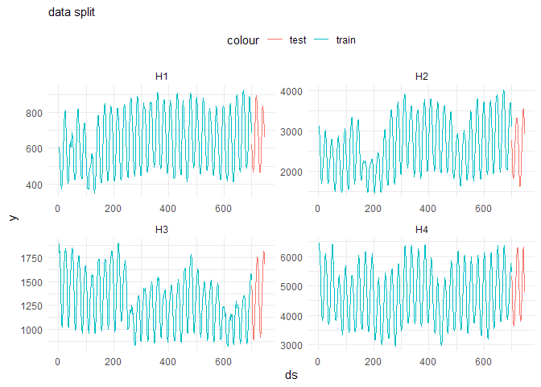
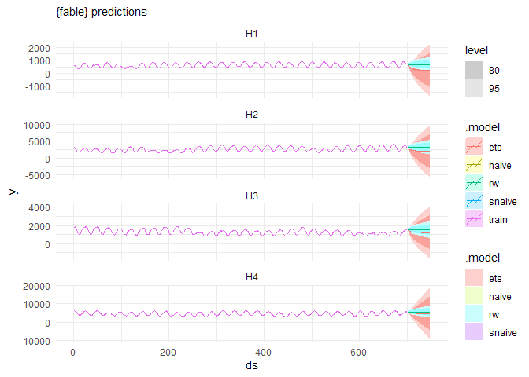
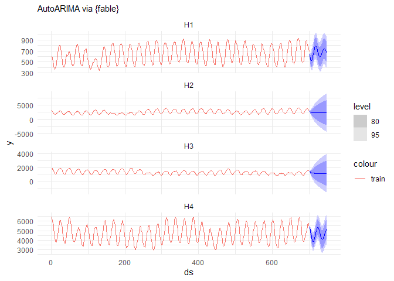
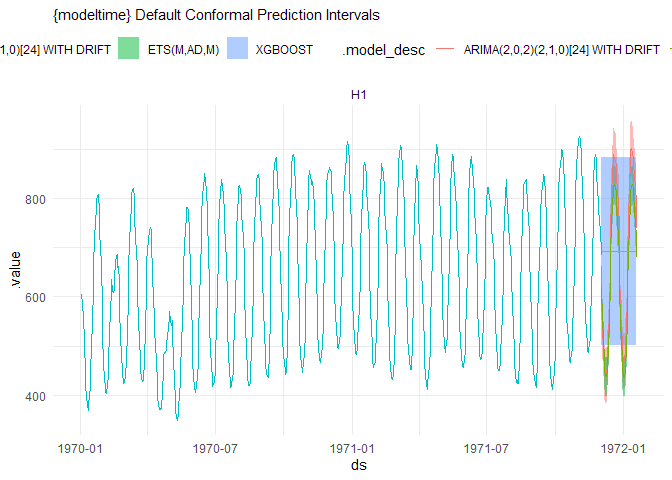
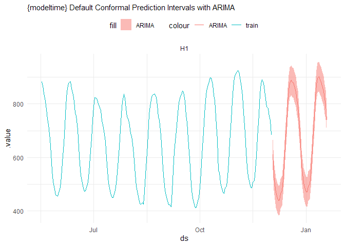

# Chapter 8 \| Conformal Prediction for Time Series and Forecasting
frankiethull

## Chapter 8 to Practical Guide to Applied Conformal Prediction in **R**:

The following code is based on the recent book release: *Practical Guide
to Applied Conformal Prediction in Python*. After posting a fuzzy GIF on
X & receiving a lot of requests for a blog or Github repo, below is
Chapter 8 of the practical guide with applications in R, instead of
Python.

While the book is not free, the Python code is open-source and a located
at the following github repo:  
*https://github.com/PacktPublishing/Practical-Guide-to-Applied-Conformal-Prediction/blob/main/Chapter_08_NixtlaStatsforecastipynb*

While this is not copy/paste direct replica of the python notebook or
book, this is a lite, supplemental R guide, & documentation for R users.

We will follow the example of time series and forecasting using fable &
conformal prediction intervals using the modeltime package.

### R setup for fable & modeltime:

``` r
# using tidymodel framework:
library(tidymodels) # ml modeling api
```

    ── Attaching packages ────────────────────────────────────── tidymodels 1.1.0 ──

    ✔ broom        1.0.5     ✔ recipes      1.0.6
    ✔ dials        1.2.0     ✔ rsample      1.1.1
    ✔ dplyr        1.1.2     ✔ tibble       3.2.1
    ✔ ggplot2      3.4.2     ✔ tidyr        1.3.0
    ✔ infer        1.0.4     ✔ tune         1.1.1
    ✔ modeldata    1.1.0     ✔ workflows    1.1.3
    ✔ parsnip      1.1.0     ✔ workflowsets 1.0.1
    ✔ purrr        1.0.1     ✔ yardstick    1.2.0

    ── Conflicts ───────────────────────────────────────── tidymodels_conflicts() ──
    ✖ purrr::discard() masks scales::discard()
    ✖ dplyr::filter()  masks stats::filter()
    ✖ dplyr::lag()     masks stats::lag()
    ✖ recipes::step()  masks stats::step()
    • Use suppressPackageStartupMessages() to eliminate package startup messages

``` r
library(modeltime)  # tidy time series
library(fable)      # tidy time series
```

    Loading required package: fabletools


    Attaching package: 'fabletools'

    The following object is masked from 'package:yardstick':

        accuracy

    The following object is masked from 'package:parsnip':

        null_model

    The following objects are masked from 'package:infer':

        generate, hypothesize

``` r
library(timetk)     # temporal kit
library(tsibble)    # temporal kit
```


    Attaching package: 'tsibble'

    The following objects are masked from 'package:base':

        intersect, setdiff, union

``` r
library(dplyr)      # pliers keep it tidy 
library(ggplot2)    # data viz
library(reticulate) # pass the python example dataset :)
```

    Warning: package 'reticulate' was built under R version 4.3.1

``` r
library(doParallel) # model tuning made fast
```

    Loading required package: foreach


    Attaching package: 'foreach'

    The following objects are masked from 'package:purrr':

        accumulate, when

    Loading required package: iterators

    Loading required package: parallel

### Load the dataset

``` r
train = read.csv('https://auto-arima-results.s3.amazonaws.com/M4-Hourly.csv')
test = read.csv('https://auto-arima-results.s3.amazonaws.com/M4-Hourly-test.csv')
```

``` r
train |> head()
```

      unique_id ds   y
    1        H1  1 605
    2        H1  2 586
    3        H1  3 586
    4        H1  4 559
    5        H1  5 511
    6        H1  6 443

### Train the models

we will only use the first 4 series of the dataset to reduce the total
computational time.

``` r
n_series <- 4
uids <- paste0("H", seq(1:n_series))

train <- train |> filter(unique_id %in% uids) |> group_by(unique_id)
test  <- test  |> filter(unique_id %in% uids)
```

``` r
train |>
  ggplot() +
  geom_line(aes(x = ds, y = y, color = "train")) +
  geom_line(inherit.aes = FALSE,
            data = test, 
            aes(x = ds, y = y, color = "test")) + 
  facet_wrap(~unique_id, scales = "free") +
  theme_minimal() + 
  theme(
    legend.position = "top"
  ) + 
  labs(subtitle = "data split")
```



#### Create a list of models using fable

for this example we are using fable library  
fable is a ‘tidy’ version of the forecast library.

Both are user-friendly & have accompanying books (fpp2 & fpp3 by rob
hyndman). \##### plot prediction intervals

``` r
train_fbl <- train |> tsibble::as_tsibble(index = ds, key = unique_id)
test_fbl  <- test  |> tsibble::as_tsibble(index = ds, key = unique_id)

train_fbl |>
  model(
    ets = ETS(y),
    naive = NAIVE(y),
    rw = RW(y),
    snaive = SNAIVE(y)
  ) |>
  forecast(new_data = test_fbl) |>
  autoplot() + 
  geom_line(inherit.aes = FALSE,
            data = train_fbl,
            aes(x = ds, y = y, color = "train")) +
  theme_minimal() + 
  labs(subtitle = "{fable} predictions")
```

    Warning: 4 errors (1 unique) encountered for snaive
    [4] Non-seasonal model specification provided, use RW() or provide a different lag specification.

    Warning in max(ids, na.rm = TRUE): no non-missing arguments to max; returning
    -Inf

    Warning in max(ids, na.rm = TRUE): no non-missing arguments to max; returning
    -Inf

    Warning in max(ids, na.rm = TRUE): no non-missing arguments to max; returning
    -Inf

    Warning in max(ids, na.rm = TRUE): no non-missing arguments to max; returning
    -Inf

    Warning in max(ids, na.rm = TRUE): no non-missing arguments to max; returning
    -Inf

    Warning in max(ids, na.rm = TRUE): no non-missing arguments to max; returning
    -Inf

    Warning in max(ids, na.rm = TRUE): no non-missing arguments to max; returning
    -Inf

    Warning in max(ids, na.rm = TRUE): no non-missing arguments to max; returning
    -Inf

    Warning: Removed 192 rows containing missing values (`()`).



``` r
train_fbl |>
  model(
    auto_arima = ARIMA(y)
  ) |>
  forecast(new_data = test_fbl) |>
  autoplot() + 
  geom_line(inherit.aes = FALSE,
            data = train_fbl,
            aes(x = ds, y = y, color = "train")) +
  theme_minimal() +
  labs(subtitle = "AutoARIMA via {fable}")
```



The next section will switch to a modeltime workflow. modeltime is the
tidymodels for time series.

#### Conformal Prediction with modeltime

There are two methods for conformal prediction in modeltime, it is the
only tidy timeseries library I know of that supports conformal
prediction options internally and by default.

The default method is quantile method but there is an option for split
method as well.

##### train models

``` r
# let's use for one location:
mt_train <- train |> filter(unique_id == uids[[1]]) |> mutate(ds = as.Date(ds))
mt_test  <- test  |> filter(unique_id == uids[[1]]) |> mutate(ds = as.Date(ds))

# ETS 
ets_fit <- exp_smoothing(seasonal_period = 24) |>
           set_engine("ets") |>
           fit(y ~ ds, data = mt_train)

# Auto ARIMA 
arima_fit <- arima_reg(seasonal_period = 24) |>
             set_engine("auto_arima") |>
             fit(y ~ ds, data = mt_train)

# XGB 
xgb_fit <- boost_tree("regression") |>
           set_engine("xgboost") |>
           fit(y ~ ds, data = mt_train)

# modeltime workflow
modtime_fcst <- 
  modeltime_calibrate(
            modeltime_table(
                xgb_fit,
                arima_fit,
                ets_fit
                ), 
              new_data = mt_test, 
              quiet = FALSE,
              id = "unique_id"
            ) |>
      modeltime_forecast(
        new_data = mt_test,
        conf_interval = 0.80,
        conf_method  = "conformal_default",
        conf_by_id = TRUE,
        keep_data  = TRUE
    )
```

##### plot prediction intervals

``` r
modtime_fcst |>
ggplot() + 
  geom_ribbon(aes(x = ds, ymin = .conf_lo, ymax = .conf_hi, fill = .model_desc), 
              alpha = 0.5) + 
  geom_line(aes(x = ds, y = .value, color = .model_desc)) +
  geom_line(inherit.aes = FALSE,
            data = mt_train,
            aes(x = as.Date(ds), y = y, color = "train")) +
  facet_wrap(~unique_id, scales = "free") + 
  theme_minimal() +
  theme(legend.position = "top") + 
  labs(subtitle = "{modeltime} Default Conformal Prediction Intervals") 
```



``` r
modtime_fcst |>
  filter(stringr::str_detect(.model_desc, "ARIMA")) |> 
ggplot() + 
  geom_ribbon(aes(x = ds, ymin = .conf_lo, ymax = .conf_hi, fill = "ARIMA"), 
              alpha = 0.5) + 
  geom_line(aes(x = ds, y = .value, color = "ARIMA")) +
  geom_line(inherit.aes = FALSE,
            data = mt_train |> tail(-500),
            aes(x = as.Date(ds), y = y, color = "train")) +
  facet_wrap(~unique_id, scales = "free") + 
  theme_minimal() +
  theme(legend.position = "top") + 
  labs(subtitle = "{modeltime} Default Conformal Prediction Intervals with ARIMA") 
```


