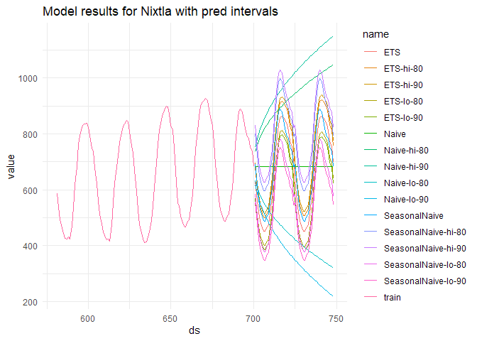
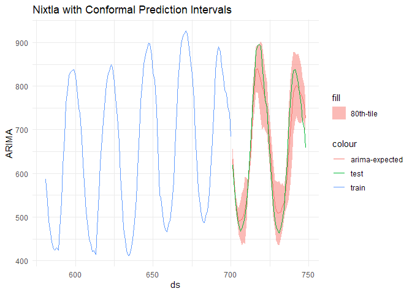

# Chapter 8 \| Conformal Prediction for Time Series and Forecasting
frankiethull

## Chapter 8 to Practical Guide to Applied Conformal Prediction in **R**:

The following code is based on the recent book release: *Practical Guide
to Applied Conformal Prediction in Python*. After posting a fuzzy GIF on
X & receiving a lot of requests for a blog or Github repo, below is
Chapter 8 of the practical guide with applications in R, instead of
Python.

While the book is not free, the Python code is open-source and a located
at the following github repo:  
*https://github.com/PacktPublishing/Practical-Guide-to-Applied-Conformal-Prediction/blob/main/Chapter_08_NixtlaStatsforecast.ipynb*

While this is not copy/paste direct replica of the python notebook or
book, this is a lite, supplemental R guide, & documentation for R users.

We will follow the example of time series and forecasting using fable &
conformal prediction intervals using the **nixtla package via
reticulate**.

``` r
# reticulate::py_install("statsforecast", pip = TRUE)
```

### R setup for nixtla, a python lib accessed via reticulate:

``` r
library(dplyr)      # pliers keep it tidy 
```


    Attaching package: 'dplyr'

    The following objects are masked from 'package:stats':

        filter, lag

    The following objects are masked from 'package:base':

        intersect, setdiff, setequal, union

``` r
library(ggplot2)    # data viz
library(reticulate) # pass the python example dataset :)
```

    Warning: package 'reticulate' was built under R version 4.3.1

``` r
# statsforecast r-to-py API obj
sf <- reticulate::import("statsforecast")

# or like this for submodules:
#ets <- reticulate::py_run_string("from statsforecast.models import ETS")
```

### Load the dataset

``` r
train = read.csv('https://auto-arima-results.s3.amazonaws.com/M4-Hourly.csv')
test  = read.csv('https://auto-arima-results.s3.amazonaws.com/M4-Hourly-test.csv')
```

### Train the models

we will only use the first series of the dataset to reduce the total
computational time.

``` r
n_series <- 1
uids <- paste0("H", seq(1:n_series))

train <- train |> filter(unique_id %in% uids) |> group_by(unique_id)
test  <- test  |> filter(unique_id %in% uids)

horizon <- test |> filter(unique_id == uids[[1]]) |> nrow()
```

### nixtla model setup as R interfaces

one thing R coders need to look out for is dtypes. *integers* instead of
*dbl/numeric* are often needed in Python for parm setting.

In R, need to wrap with as.integer()

When importing a python module, explore the various submodules using
**\$**. This allows access to underlying python tools as APIs inside of
R.

``` r
# compare these to the initial using str() col types are different and nixtla won't throw errors on int types

train_nix <- train |> mutate(ds = as.integer(ds))
test_nix  <- test  |> mutate(ds = as.integer(ds))

models <- c(sf$models$ETS(season_length = as.integer(24)),
            sf$models$Naive(),
            sf$models$SeasonalNaive(season_length = as.integer(24))
            )

nixfit <- sf$StatsForecast(
    df=train_nix,
    models=models,
    freq=as.integer(1)
)

levels <- c(80, 90)

nixcast <- nixfit$forecast(h = as.integer(horizon), 
                           level = as.integer(levels))
```

    Warning in py_to_r.pandas.core.frame.DataFrame(result): index contains
    duplicated values: row names not set

``` r
nixcast |> head()
```

       ds      ETS ETS-lo-90 ETS-lo-80 ETS-hi-80 ETS-hi-90 Naive Naive-lo-80
    1 701 631.8896  568.9789  582.8741  680.9051  694.8004   684    631.6456
    2 702 559.7509  496.5244  510.4893  609.0123  622.9773   684    609.9597
    3 703 519.2355  455.6948  469.7292  568.7418  582.7761   684    593.3195
    4 704 486.9734  423.1201  437.2235  536.7233  550.8267   684    579.2911
    5 705 464.6974  400.5330  414.7051  514.6896  528.8618   684    566.9319
    6 706 452.2620  387.7880  402.0285  502.4955  516.7360   684    555.7584
      Naive-lo-90 Naive-hi-80 Naive-hi-90 SeasonalNaive SeasonalNaive-lo-80
    1    616.8038    736.3544    751.1962           691            582.8238
    2    588.9702    758.0403    779.0298           618            509.8238
    3    567.6128    774.6805    800.3872           563            454.8238
    4    549.6076    788.7089    818.3924           529            420.8238
    5    533.7448    801.0681    834.2552           504            395.8238
    6    519.4036    812.2416    848.5964           489            380.8238
      SeasonalNaive-lo-90 SeasonalNaive-hi-80 SeasonalNaive-hi-90
    1            552.1573            799.1762            829.8427
    2            479.1574            726.1762            756.8427
    3            424.1574            671.1762            701.8427
    4            390.1574            637.1762            667.8427
    5            365.1574            612.1762            642.8427
    6            350.1574            597.1762            627.8427

### plotting prediction intervals

``` r
#plotly::ggplotly(
nixcast |>
  tidyr::pivot_longer(-ds) |>
  ggplot() + 
  geom_line(aes(x = ds, y = value, color = name)) + 
  geom_line(inherit.aes = FALSE,
            data = train_nix |> tail(24*5), 
            aes(x = ds, y = y, color = "train")) + 
  theme_minimal() +
  labs(title = "Model results for Nixtla with pred intervals")
```



``` r
#)
```

### Conformal Prediction with Nixtla

once again, we will initiate models but specify conformal intervals in
the model spec

``` r
# conformal intervals are under utils:
conf_int <- sf$utils$ConformalIntervals(h = as.integer(horizon),
                                        n_windows = as.integer(2))

# arima ints:
arima_order <- sapply(c(24,0, 12), as.integer)
# Create a list of models and instantiation parameters
conf_models = c(
    sf$models$ADIDA(prediction_intervals=conf_int),
    sf$models$ARIMA(order=arima_order, 
                    season_length=as.integer(24), 
                    prediction_intervals=conf_int)
)

conf_nixfit <- sf$StatsForecast(
    df=train_nix,
    models=conf_models,
    freq=as.integer(1)
)

levels <- c(80, 90)

conf_nixcast <- conf_nixfit$forecast(h = as.integer(horizon), 
                           level = as.integer(levels))
```

    Warning in py_to_r.pandas.core.frame.DataFrame(result): index contains
    duplicated values: row names not set

``` r
conf_nixcast |> head()
```

       ds    ADIDA ADIDA-lo-90 ADIDA-lo-80 ADIDA-hi-80 ADIDA-hi-90    ARIMA
    1 701 747.2925      628.30       634.6    859.9851    866.2851 631.4179
    2 702 747.2925      551.20       552.4    942.1851    943.3851 570.8654
    3 703 747.2925      517.65       522.3    972.2851    976.9351 533.0674
    4 704 747.2925      480.35       484.7   1009.8851   1014.2351 505.9376
    5 705 747.2925      454.10       459.2   1035.3851   1040.4851 490.0570
    6 706 747.2925      441.80       446.6   1047.9851   1052.7850 492.3616
      ARIMA-lo-90 ARIMA-lo-80 ARIMA-hi-80 ARIMA-hi-90
    1    602.3105    605.7851    657.0508    660.5254
    2    551.2000    552.4000    589.3306    590.5306
    3    514.3702    515.7404    550.3943    551.7645
    4    480.3500    484.7000    527.1752    531.5253
    5    454.1000    459.2000    520.9139    526.0140
    6    441.8000    446.6000    538.1231    542.9232

``` r
conf_nixcast |>
  select(ds, starts_with("ARIMA")) |>
  ggplot() + 
  geom_ribbon(aes(x = ds, ymin = `ARIMA-lo-80`, ymax = `ARIMA-hi-80`, fill = "80th-tile"),
              alpha = 0.5) + 
  geom_line(aes(x = ds, y = ARIMA, color = "arima-expected")) +
    geom_line(inherit.aes = FALSE,
            data = train_nix |> tail(24*5), 
            aes(x = ds, y = y, color = "train")) + 
    geom_line(inherit.aes = FALSE,
              data = test_nix,
             aes(x = ds, y = y, color = "test")) + 
  theme_minimal() +
  labs(title = "Nixtla with Conformal Prediction Intervals")
```


