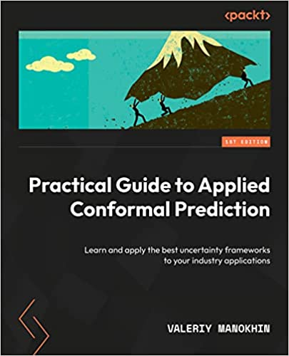

# Practical Guide to Applied Conformal Prediction in **R**
frankiethull

The following code is based on the recent book release: *Practical Guide
to Applied Conformal Prediction in Python*. After posting a fuzzy GIF on
X & receiving a lot of requests for a blog or Github repo, this repo
includes the practical guide with applications in R, instead of Python.

This is not copy/paste direct replica of the python notebook or book,
this is a lite, supplemental R guide, & documentation for R users.

